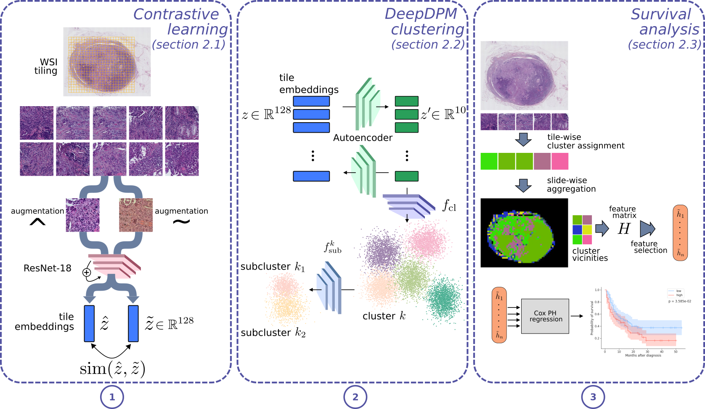

# WhARIO

Code associated to the [article](): *WhARIO: Whole-slide-image-based survival Analysis for patients tReated with ImmunOtherapy*, published in **Journal of Medical Imaging**.

WhARIO is a 3-step pipeline to extract features from Whole-Slide Images (WSIs) to predict lung cancer patient survival following immunotherapy:

## Step 1: Contrastive Learning

Contrastive learning is used as a first step to reduce the dimension of the images before clustering. The method used in this work is the well-known simCLR algorithm ([Chen et al., 2018](https://proceedings.mlr.press/v119/chen20j.html)).

**TODO: Add contrastive learning scripts.**

## Step 2: Clustering

For clustering, we use a nonparametric deep clustering algorithm called DeepDPM ([Ronen et al., 2022](https://arxiv.org/abs/2203.14309)). The official implementation was used for this work ([github](https://github.com/BGU-CS-VIL/DeepDPM?tab=readme-ov-file)).

## Step 3: Survival analysis

The first step in this section is to compute the cluster adjacency matrices. Once the matrices are available, the feature forward selection algorithm chooses which cluster interactions are the most correlated to survival. Finally, a Cox PH model is trained thanks to these features to predict patient survival.

### Get neighboring tiles

For this section, each slide should be saved as a h5 file which contains a key `coords` to store the coordinates of each tile in the slide.

### Get cluster adjacency matrix

### Feature selection and survival prediction

The feature selection process and survival prediction is detailed in the jupyter notebook `survival_prediction.ipynb`. To run the notebook, make sure the clinical data is saved according to the format of the .xlsx spreadsheet `clinical_data.xlsx`.

For each slide in the dataset, there should also be a matching `.pkl` file (python pickle file) containing a cluster adjacency matrix of size $K\times(K+1)$ (where $K$ is the number of clusters) as a `numpy` array.
